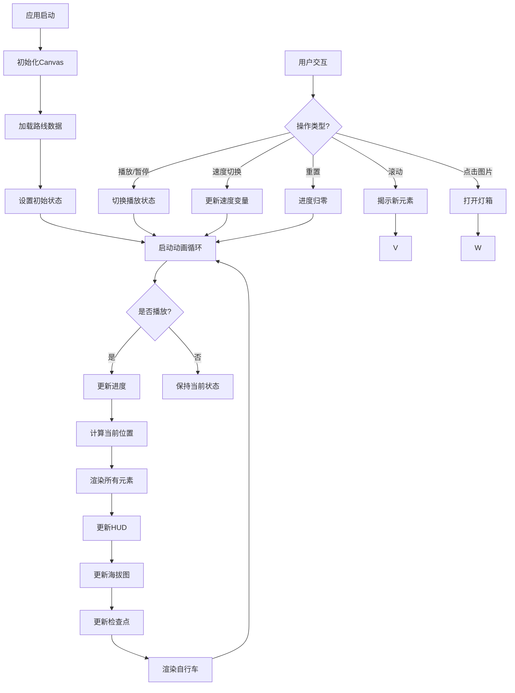

# 骑闯天路 2017 赛博朋克纪念版


## 项目介绍

这是一个纪念2017年骑闯天路深圳站自行车赛的单页Web应用，采用赛博朋克/合成波美学风格，通过Canvas动画技术生动再现了全程131.4公里的骑行轨迹。项目不仅展示了赛事的地理路线，还包含了详细的海拔变化、检查点信息和实时遥测数据，为用户提供沉浸式的视觉体验。

本项目基于Vite构建，采用模块化JavaScript架构，将UI交互、轨迹渲染和数据管理分离，确保代码的可维护性和可扩展性。应用支持响应式设计，可在桌面和移动设备上流畅运行。

## 技术架构

### 整体架构

```
+-------------------+
|    用户界面层     |
|  (HTML/CSS/JS)    |
+-------------------+
         ↓
+-------------------+
|   业务逻辑层      |
|  (轨迹渲染引擎)   |
+-------------------+
         ↓
+-------------------+
|   数据管理层      |
|  (路线数据存储)   |
+-------------------+
```

### 技术栈

- **前端框架**: 原生HTML/CSS/JavaScript (无框架)
- **构建工具**: Vite 5.4.0
- **模块系统**: ES6 Modules
- **渲染技术**: HTML5 Canvas
- **动画技术**: requestAnimationFrame
- **UI交互**: IntersectionObserver, 事件监听
- **样式技术**: CSS Variables, Media Queries

### 项目结构

```
bike-project/
├── src/                    # 源代码目录
│   ├── assets/             # 静态资源（图片）
│   ├── js/                 # JavaScript模块
│   │   ├── main.js         # 模块入口点
│   │   ├── trajectory.js   # Canvas渲染和动画
│   │   ├── trajectoryData.js # 路线数据和常量
│   │   └── ui.js           # 用户界面交互
│   └── styles/             # CSS样式表
│       └── main.css        # 主样式表
├── public/                 # 公共静态文件
│   └── imgs/               # 图片资源
├── dist-build/             # 生产构建输出
├── node_modules/           # 依赖包
├── package.json            # 项目配置
├── package-lock.json       # 依赖锁定
└── vite.config.js          # Vite配置（默认）
```

## 功能特性

### 核心功能

1. **动态轨迹可视化**
   - 基于Canvas的平滑骑行轨迹动画
   - 30fps帧率控制确保流畅体验
   - 脉冲效果和光效增强视觉表现

2. **实时遥测显示**
   - 当前里程、海拔、速度和耗时
   - 进度百分比指示器
   - 赛事编号#1387571标识

3. **检查点系统**
   - 6个主要检查点标记（含起点和终点）
   - 检查点脉冲动画效果
   - 检查点名称和里程标注

4. **海拔剖面图**
   - 底部显示全程海拔变化
   - 当前位置在剖面图上的标记
   - 最高海拔点（265米）特殊标注

5. **一级虐点标识**
   - 4个最具挑战性的爬坡路段
   - 特殊的火焰图标和橙色标记
   - 虐点名称和海拔标注

### 交互功能

- **播放控制**
  - 播放/暂停按钮
  - 速度切换（0.5x, 1x, 2x, 4x）
  - 重置动画到起点

- **UI交互**
  - 滚动揭示动画（Scroll Reveal）
  - 图片灯箱查看器（Lightbox）
  - 响应式移动菜单
  - 加载器动画

## 功能流程图



## 安装与依赖

### 系统要求

- Node.js 18.0.0 或更高版本
- npm 8.0.0 或更高版本
- 现代浏览器（Chrome, Firefox, Safari, Edge）

### 安装步骤

1. 克隆项目仓库：

```bash
git clone https://github.com/your-username/bike-project.git
```

2. 进入项目目录：

```bash
cd bike-project
```

3. 安装依赖包：

```bash
npm install
```

### 依赖说明

项目依赖在`package.json`中定义：

```json
{
  "devDependencies": {
    "vite": "^5.4.0"
  }
}
```

- **Vite**: 作为开发服务器和构建工具，提供快速的热重载和高效的生产构建

## 开发环境

### 启动开发服务器

```bash
npm run dev
```

这将启动Vite开发服务器，默认在`http://localhost:5173`上运行。服务器支持热模块替换（HMR），代码更改会自动反映在浏览器中。

### 开发工作流

1. 启动开发服务器：`npm run dev`
2. 在浏览器中访问`http://localhost:5173`
3. 编辑`src/`目录下的文件
4. 查看实时更新的更改
5. 使用浏览器开发者工具调试

### 环境配置

项目使用Vite默认配置，无需额外配置文件。如需自定义，可创建`vite.config.js`文件。

## 生产环境部署

### 构建生产版本

```bash
npm run build
```

此命令将：

1. 优化和压缩所有资源
2. 生成静态文件到`dist-build/`目录
3. 创建生产就绪的构建版本

构建完成后，`dist-build/`目录将包含所有需要部署的文件。

### 预览生产版本

```bash
npm run preview
```

此命令在本地启动一个静态服务器来预览生产构建，运行在`http://localhost:4173`。这有助于在部署前验证构建是否正常工作。

### 部署选项

#### 1. 静态网站托管

将`dist-build/`目录中的文件上传到任何静态网站托管服务：

- GitHub Pages
- Vercel
- Netlify
- AWS S3
- 阿里云OSS

#### 2. 传统Web服务器

将`dist-build/`目录部署到任何Web服务器（Apache, Nginx等）的文档根目录。

#### 3. Docker容器化

创建Dockerfile：

```dockerfile
FROM nginx:alpine
COPY dist-build/ /usr/share/nginx/html/
EXPOSE 80
```

构建并运行：

```bash
docker build -t bike-project .
docker run -d -p 8080:80 bike-project
```

## 特色亮点

### 1. 精确的路线还原

项目基于真实的行者路书#1387571 GPS数据，精确还原了2017年骑闯天路深圳站的全程路线。通过将GPS坐标映射到Canvas像素坐标，确保了路线的准确性。

### 2. 性能优化

- **帧率控制**: 通过`TARGET_FRAME_INTERVAL`限制动画循环到30fps，避免过度消耗CPU资源
- **脉冲缓存**: 脉冲值每10帧更新一次，减少随机数计算频率
- **离屏渲染**: 使用Canvas的绘制批处理，减少重绘次数

### 3. 视觉特效

- **霓虹效果**: 使用CSS变量和Canvas阴影创建赛博朋克风格的霓虹光效
- **故障动画**: 通过随机脉冲值创建动态的故障效果
- **渐变动画**: 使用Canvas线性渐变创建流动的轨迹效果

### 4. 模块化设计

项目采用ES6模块化设计，将不同功能分离到独立文件：

- `trajectory.js`: 负责核心的轨迹渲染和动画逻辑
- `trajectoryData.js`: 管理所有路线数据和常量
- `ui.js`: 处理用户界面交互
- `main.js`: 作为模块入口点，整合所有功能

### 5. 响应式设计

应用采用响应式设计，通过CSS媒体查询适配不同屏幕尺寸：

- 桌面端：充分利用大屏幕空间
- 平板端：调整布局和字体大小
- 手机端：简化UI，优化触摸交互

## 关键实现说明

### 轨迹插值算法

使用线性插值（lerp）在航点之间创建平滑动画：

```javascript
function posAt(t) {
  const sf = t * (N - 1);
  const s  = Math.floor(sf);
  const f  = sf - s;
  if (s >= N - 1) return { x: route[N-1].x, y: route[N-1].y };

  const a = route[s], b = route[s + 1];
  return {
    x: lerp(a.x, b.x, f),
    y: lerp(a.y, b.y, f),
    km: lerp(a.km, b.km, f),
    elev: lerp(a.elev, b.elev, f)
  };
}
```

### 动画循环

主动画循环使用`requestAnimationFrame`实现：

```javascript
function frame(ts) {
  // 帧率节流
  const elapsed = ts - lastFrameTime;
  if (elapsed < TARGET_FRAME_INTERVAL) {
    requestAnimationFrame(frame);
    return;
  }

  lastFrameTime = ts - (elapsed % TARGET_FRAME_INTERVAL);

  // 更新脉冲缓存
  updatePulseValues();

  // 更新进度
  if (playing) {
    progress += 0.00035 * speed;
    if (progress > 1) progress = 0;
  }

  // 清空画布并重新绘制
  ctx.fillStyle = '#0a0a0f';
  ctx.fillRect(0, 0, CW, CH);

  // 绘制所有元素
  drawGrid();
  drawCoastline();
  drawSegLabels();
  drawRouteFull();
  drawRouteActive();
  drawCheckpoints();

  const p = posAt(progress);
  drawBike(p.x, p.y, p.a);
  drawHUD(p);
  drawElevation();

  requestAnimationFrame(frame);
}
```

## 使用说明

### 基本操作

1. **开始/暂停**: 点击"PLAY"或"PAUSE"按钮控制动画播放
2. **调整速度**: 点击"SPEED"按钮循环切换不同播放速度
3. **重置**: 点击"RESET"按钮将动画重置到起点
4. **查看图片**: 点击画廊中的图片可放大查看
5. **导航**: 在移动设备上点击汉堡菜单可访问导航链接

### 开发者指南

#### 添加新检查点

在`src/js/trajectoryData.js`中修改`waypoints`数组：

```javascript
{
  x: 400, y: 200,           // Canvas坐标
  name: '新检查点',          // 名称
  km: 50,                   // 里程（公里）
  elev: 100,                // 海拔（米）
  isCheck: 7,               // 检查点编号
  road: '新路段',            // 道路名称
  gps: '22.550°N, 114.500°E', // GPS坐标
  checkName: '新检查点'      // 检查点显示名称
}
```

同时更新`checkpoints`数组：

```javascript
{
  km: 50,                   // 里程
  name: '新检查点',          // 名称
  elev: 100,                // 海拔
  color: '#ff00ff'          // 显示颜色
}
```

#### 修改视觉效果

在`src/styles/main.css`中调整CSS变量：

```css
:root {
  --neon-blue: #00f0ff;     /* 霓虹蓝 */
  --neon-pink: #ff00ff;     /* 霓虹粉 */
  --neon-red: #ff4466;      /* 霓虹红 */
  --neon-yellow: #f0f000;   /* 霓虹黄 */
  --bg-color: #0a0a0f;      /* 背景颜色 */
}
```

## 贡献指南

欢迎贡献！请遵循以下步骤：

1. Fork项目
2. 创建新分支：`git checkout -b feature/your-feature`
3. 提交更改：`git commit -m 'Add some feature'`
4. 推送到分支：`git push origin feature/your-feature`
5. 创建Pull Request

### 代码风格

- 使用ES6+语法
- 遵循项目现有的代码风格
- 添加必要的注释
- 确保代码可读性和可维护性

## 许可证

本项目采用MIT许可证。详情请参阅[LICENSE](LICENSE)文件。

## 致谢

- 感谢所有参与2017年骑闯天路深圳站的骑行者
- 感谢行者路书提供GPS数据
- 感谢Vite团队提供优秀的构建工具

## 目录说明

项目中包含两个重要的输出目录，它们有不同的用途：

- `dist/`: 这是单页面HTML应用的原始文档目录，包含了未经构建处理的原始index.html文件和相关资源。这个目录主要用于备份和参考，可以直接在浏览器中打开index.html文件进行查看。

- `dist-build/`: 这是Vite构建命令(`npm run build`)的输出目录，包含了经过优化、压缩和打包后的生产版本文件。这个目录中的文件是用于实际部署的，包含了所有必要的静态资源，已经过构建工具处理，适合在生产环境中使用。

## 联系方式

如有任何问题或建议，请通过以下方式联系：

- 邮箱: example@email.com
- GitHub: [@your-username](https://github.com/your-username)
